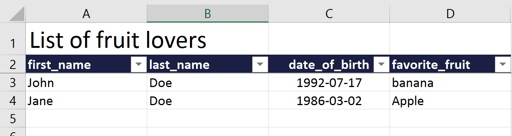

===========
Quick start
===========

Installation
------------

Python package::

    pip install openpyxl-templates

Creating your template
----------------------
The first thing you need to do is to create your workbook template. Below is an example using the TableSheet to create an template for listing fruit loving persons.

.. literalinclude:: examples/simple_usage.py
    :lines: 1-25

Writing
-------
To write create an instance of your templated workbook, supply the  sheets with data and save.
.. literalinclude:: examples/simple_usage.py
    :lines: 30-37

Reading
-------
To read
.. literalinclude:: examples/simple_usage.py
    :lines: 43-46
