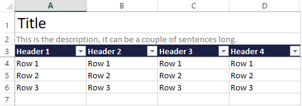

==========
TableSheet
==========
The ``TableSheet`` is a ``TemplatedWorksheet`` making it easy for reading and write excel Data Table. It is made up of an ordered set of typed columns which support when converting to and from Excel. Read more about what the columns do :ref:`here <table_sheet_columns>`.

Elements of the TableSheet
--------------------------

The ``TableSheet`` recognizes the following elements:
 * **Title** (optional) - A bold header for the Data Table
 * **Description** (optional) - A smaller description intended for simple instructions
 * **Columns** - The Columns in the datatable, which in turn is made up of **headers** and **rows**

.. literalinclude:: ../examples/table_sheet_elements.py

The TableSheet does not support reading the title or description.

Creating the TableSheet
-----------------------

A ``TableSheet`` is created by extending the TableSheet class, declaring columns and optionally changing styling and other settings. Once the TableSheet class has been created an instance of this class is be supplied to the ``TemplatedWorkbook``.

Declaring columns
^^^^^^^^^^^^^^^^^
The columns are declared as class variables on a TableSheet which will identify and register the columns (in order of declaration). The columns are avaliable under the ``columns`` attribute.

A TableSheet must always have atleast one ``TableColumn``.

.. literalinclude:: ../examples/table_sheet.py
    :lines: 1-6

The column declaration supports inheritance, the following declaration is perfectly legal.

.. literalinclude:: ../examples/table_sheet.py
    :lines: 14-15

Note that the columns of the parent class are always considered to have been declared before the columns of the child.

All columns must have a header and there must not be any duplicated headers within the same sheet. The TableSheet will automatically use the attribute name used when declaring the column as header.

.. literalinclude:: ../examples/table_sheet.py
    :lines: 22-24

Writing
-------

Writing is done by passing data to the write function. The function will:
    * Prepare the workbook by registering all required styles, data validation etc.
    * Write title, and description if they are supplied
    * Create the headers and rows
    * Apply sheet level formatting such as creating the Data Table and setting the freeze pane

Writing will always recreate the entire sheet from scratch, so any preexisting data will be lost. If you want to preserve your data you could read existing rows and combine them with the new data.

.. literalinclude:: ../examples/table_sheet_write_read.py
    :lines: 5-34

Styling
^^^^^^^

The TableSheet has two style attributes which can be modified:
    * ``tile_style`` - Name of the style to be used for the title, defaults to *"Title"*
    * ``description_style`` - Name of the style to be used for the description, defaults to *"Description"*

.. literalinclude:: ../examples/table_sheet.py
    :lines: 28-33

Make sure that the styles referenced are available either in the workbook or in the ``StyleSet`` of the ``TemplatedWorkbook``. Read more about styling :ref:`styling <here>`.

Additional settings
^^^^^^^^^^^^^^^^^^^
The write behaviour of the TableSheet can be modified with the following settings:
    * ``format_as_table`` - Controlling whether the TableSheet will format the output as a DataTable, defaults to *True*
    * ``freeze_pane`` - Controlling whether the TableSheet will utilize the freeze pane feature, defaults to *True*
    * ``hide_excess_columns`` - When enabled the TableSheet will hide all columns not used by columns, defaults to *True*

Reading
-------
The ``read`` method does two things. First it will verify the format of the file by looking for the header row. If the headers cannot be found a en exception will be raised. Once the headers has been found all subsequent rows in the excel will be treated as data and parsed to `namedtuples <https://docs.python.org/3/library/collections.html#collections.namedtuple>`_ automatically after the columns has transformed the data from excel to python.

.. literalinclude:: ../examples/table_sheet_write_read.py
    :lines: 36-38

The TableSheet can also be used as an iterator directly

.. literalinclude:: ../examples/table_sheet_write_read.py
    :lines: 40-41

Exception handling
^^^^^^^^^^^^^^^^^^
    * ``exception_policy`` - Default policy for exception handling when reading, defaults to ``RaiseCellException``. See below for further details

Additional settings
^^^^^^^^^^^^^^^^^^^

    * ``look_for_headers`` - When reading and look_for_headers is True, the TableSheet will look for an exact match of the expected header row before looking for columns. Defaults to *True*. see below for further details

Looking for headers can be disabled by setting ``look_for_headers`` to *False* on the TableSheet class or passing it as an argument to the read function.

Customization
-------------
The TableSheet is built with customization in mind. If you want your table to yield something else then a ``namedtuple`` for each row. It is easy to achieve by overriding the ``create_object`` method.

.. literalinclude:: ../examples/customization.py
    :lines: 5-22

Feel free to explore the source code for additional possibilities. If you are missing hook or add a feature useful for others, feel free to submit a push request.